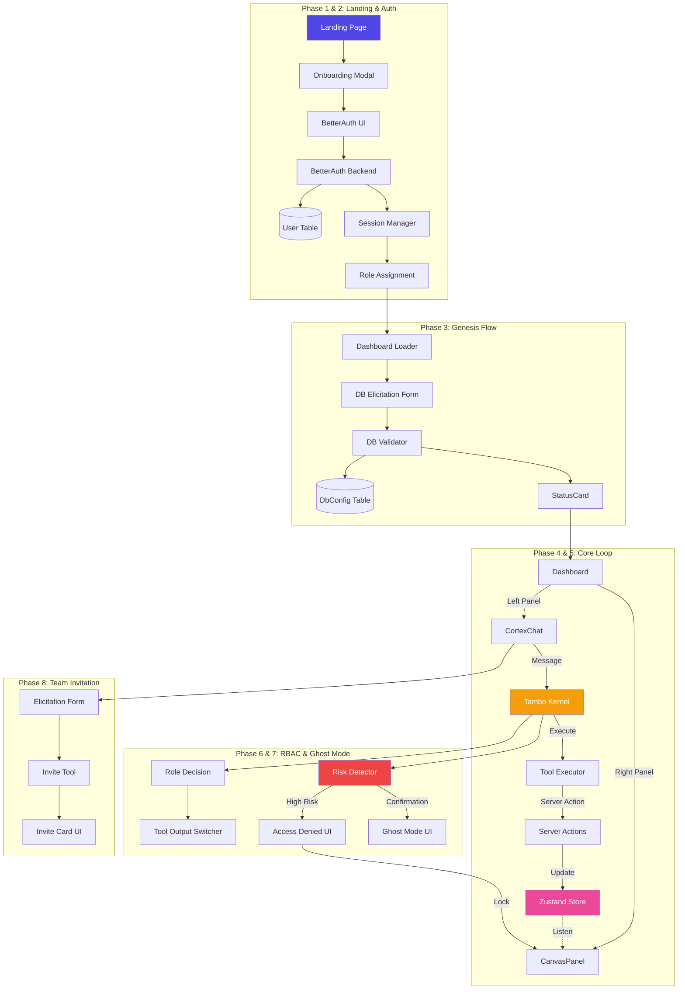

# 🧠 Cortex: The Visual Data Commander

**Powered by [Tambo AI](https://tambo.co/)**

Cortex is a production-grade, identity-aware generative database management platform. Built on the **Tambo SDK**, it transforms complex database interactions into intuitive natural language conversations with state-of-the-art Generative UI components.

## 🚀 Features

- **Generative UI**: Intelligent rendering of Graphs, Tables, and Interactive Schemas.
- **Identity-Aware**: Role-based access control (RBAC) integrated into the core conversation loop.
- **Visual Schema**: Interactive ReactFlow-based schema visualization and modification.
- **Mission Control**: Centralized dashboard for business intelligence and system monitoring.
- **Production Ready**: Built with Next.js 16, Prisma, Better-Auth, and Tailwind CSS.


## 🏗️ System Architecture

Cortex follows a sophisticated multi-phase system flow that bridges natural language intent with visual state management.



## 🛠️ Tech Stack

- **Agent Framework**: [Tambo AI](https://tambo.co/) (Core Kernel & SDK)
- **Framework**: [Next.js](https://nextjs.org/) (App Router)
- **Database**: [Prisma](https://www.prisma.io/) (PostgreSQL/SQLite)
- **Authentication**: [Better-Auth](https://better-auth.com/)
- **UI Components**: [Radix UI](https://www.radix-ui.com/), [Lucide React](https://lucide.dev/)
- **Visualization**: [ReactFlow](https://reactflow.dev/), [Recharts](https://recharts.org/)

## 🏁 Getting Started

### Prerequisites

- Node.js 20+
- PostgreSQL (or use the included SQLite for local dev)

### Local Development

1. **Clone the repository**
2. **Install dependencies**:
   ```bash
   npm install
   ```
3. **Configure environment**:
   Copy `.env-example` to `.env` and fill in the required values.
4. **Setup the database**:
   ```bash
   npx prisma migrate dev
   npm run db:setup
   ```
5. **Start the development server**:
   ```bash
   npm run dev
   ```

### 📂 File Structure Overview

| Component | Path | Description |
| :--- | :--- | :--- |
| **App Shell** | `src/app/` | Dashboard layout, landing page, and Auth API routes. |
| **Generative UI** | `src/components/cortex/` | `SchemaCanvas`, `SmartTable`, `GhostModeModal`, `InviteForm`. |
| **Chat System** | `src/components/chat/` | `CortexChat` and `CanvasPanel` split-screen implementation. |
| **Logic Layer** | `src/server/actions/` | `cortex-tools`, `connection-tools`, and `invite` server actions. |
| **Agent Kernel** | `src/tambo/` | Tambo SDK configuration and dynamic tool definitions. |
| **Core State** | `src/lib/store.ts` | Global Zustand store for Canvas/Chat synchronization. |
| **Backing DB** | `prisma/` | Schema definitions and seeds for the internal system DB. |

## 🔒 Security & Ghost Mode

Cortex implements a "Ghost Mode" for high-risk data operations. When a destructive action (like `DELETE` or `DROP`) is requested:
1. The **Risk Detector** flags the intent.
2. The UI switches to **Ghost Mode**, rendering a confirmation modal.
3. Operation only proceeds after explicit administrative confirmation and permission check.

---

Built for the **Generative UI Hackathon**. Powered by AI.
